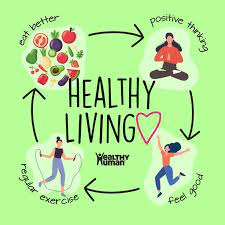

# Favorite
My favorite thing to do 
## Summary 
I enjoy upkeeping my health mentally and physically. **I believe health is wealth.** I stay motivated to do this by knowing it will pay off in my future as i age. 
- I upkeep my health by walking & running 2-3 miles a day. I enjoy doing this because it helps clear my head and keeps my inner peace balanced.
- I also enjoy this because by having inner peace it allows me to uphold my commitments to myself and responsabilites and delivering to them to the best of my ability.
- I also implement having a healthy diet in my day to day by meal prepping and only keeping healthy foods in my kitchen. I like doing this as well because it plays another factor in my health. *Less time being sick, more time to live life.*
   

Heres a link to find ways to implement healthy lifestyle that fit into your daily routine 
[YouTube](https://www.youtube.com/)
